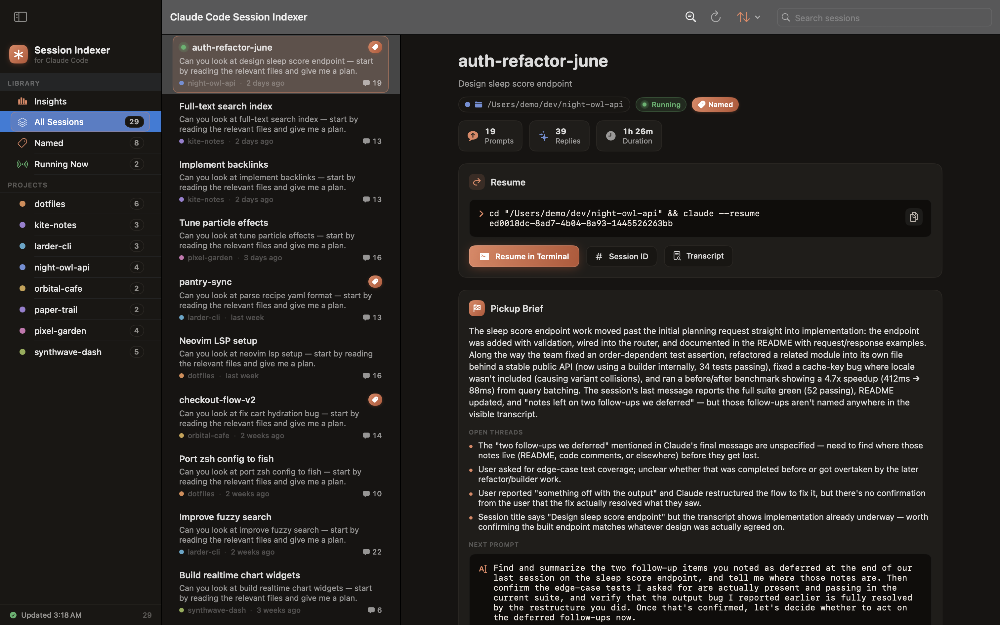
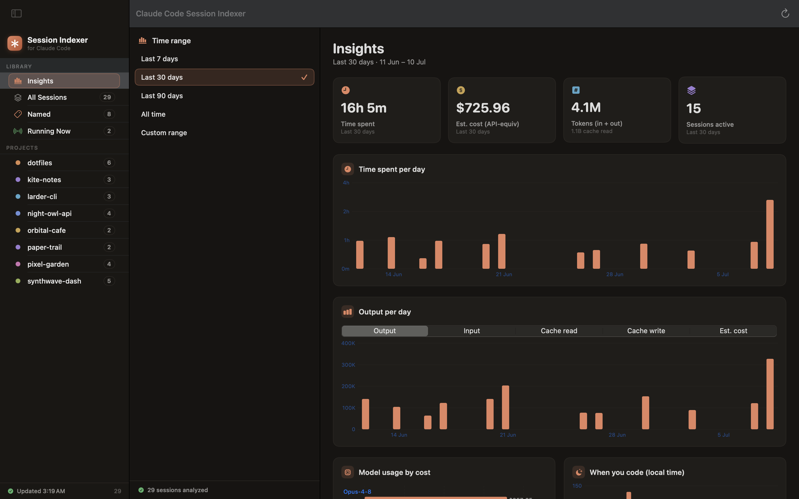
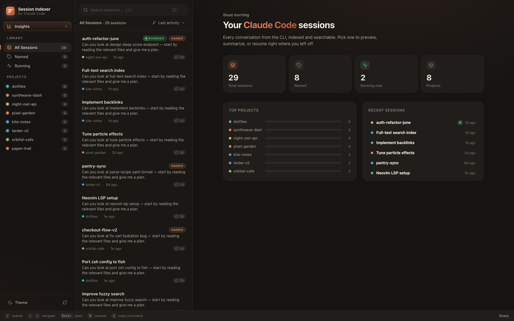

<div align="center">

# Claude Code Session Indexer

**Pick up any Claude Code session right where you left off.**

A beautiful, 100% local companion for the Claude Code CLI — browse every conversation,
understand where the work stands, and jump back in with one click.

Native macOS app · Web dashboard for Windows & Linux · Zero cloud, zero telemetry

[](LICENSE)
[](#-macos-app)
[](#-web-app-windows--linux--macos)
[](#)



<sub>All screenshots show generated demo data, not real sessions.</sub>

</div>

---

## Why Claude Code Session Indexer?

Claude Code stores every session as a JSONL transcript under `~/.claude/` — and then makes you
scroll a terminal picker to find them again. Plenty of tools let you *view* that history or
*count* your tokens. Claude Code Session Indexer is built around a different idea: **continuity** — getting back
into flow on work you started days ago.

|  | History viewers | Usage meters | **Claude Code Session Indexer** |
|---|:---:|:---:|:---:|
| Browse & resume sessions | ✅ | — | ✅ |
| Token & cost analytics | some | ✅ | ✅ |
| **Pickup Briefs** — AI "where you left off" + ready-to-paste next prompt | — | — | ✅ |
| **Deep search** inside every conversation, with snippets | — | — | ✅ |
| **Project Journals** — cross-session changelog per repo, exportable | — | — | ✅ |
| **Handoff files** — writes PROGRESS.md + CLAUDE.md so the next session picks up the work | — | — | ✅ |
| **Efficiency insights** — cache hit-rate coaching, cost per active hour | — | — | ✅ |
| Native macOS app (no Electron) | rare | — | ✅ |
| Time-spent tracking from transcripts | — | — | ✅ |

## The signature features

### ⏮ Pickup Briefs

Your fast lane back into flow. One click generates a brief for any session:
**State** (what was done, what was mid-flight), **Open threads** (unresolved bugs, deferred
TODOs), and a **ready-to-paste Next Prompt** that drops you back into productive work — no
re-reading a 60-message transcript to remember what you were doing.

### 🤝 Handoff files

Package a session's work for the *next* session: one click generates a dated **PROGRESS.md**
section (done / in progress / open threads / key decisions / how to verify) and a durable
**CLAUDE.md** knowledge block, previews both, and — only after you confirm — writes them into
that session's project directory. Your existing CLAUDE.md is never overwritten: the indexer
appends a clearly-marked section and replaces only its own marker block on regeneration.
A kickstart prompt ties it together so `claude` in a fresh session knows exactly where to begin.

### 🔎 Deep transcript search

Search *inside* the conversations, not just the titles. "Which session did I fix that CORS bug
in?" — highlighted snippets across hundreds of megabytes of transcripts, grouped by session.

### 📖 Project Journals

Every project gets an auto-stitched timeline of all its sessions — what happened, how long it
took, what it cost — readable like a changelog and exportable as Markdown.

### 📊 Insights

Time spent per day, tokens and estimated cost (API-equivalent) with 7/30/90-day and custom
ranges, per-model and per-project breakdowns, an hour-of-day rhythm chart — plus plain-language
efficiency insights like your prompt-cache hit rate and what it's saving you.

<div align="center">

</div>

And the essentials are all there: sessions grouped by project with your custom `/rename` names
front and center, live "running now" detection, AI summaries, one-click **Resume in Terminal**,
copyable resume commands, and a conversation preview.

## 🖥 macOS app

Native SwiftUI — no Electron, no web view. Warm charcoal/cream design with light & dark mode.

```sh
git clone https://github.com/SXD390/claude-code-session-indexer.git && cd claude-code-session-indexer
./scripts/build_app.sh
open "dist/Claude Code Session Indexer.app"        # drag into /Applications to keep it
```

Requires macOS 14+ and Xcode command-line tools.

## 🌐 Web app (Windows · Linux · macOS)

The same product as a local web dashboard — one file server, **zero npm dependencies**, no build
step, bound strictly to `127.0.0.1`.

```sh
./web/start.sh                  # macOS / Linux
```

```bat
web\"Start Session Indexer.bat"         :: Windows — or just double-click it
```

Then open <http://127.0.0.1:4747>. Requires Node 18+. `/` to search, `↑↓` to navigate,
`R` to resume, `C` to copy the resume command.

<div align="center">

</div>

## How it works

| Source | Used for |
|---|---|
| `~/.claude/projects/*/<uuid>.jsonl` | sessions, titles (your `/rename` names > AI titles > first prompt), messages, per-message token usage |
| `~/.claude/sessions/*.json` | live "running now" detection (PID-checked) |
| `claude -p` (your own CLI) | AI summaries & Pickup Briefs, generated on demand and cached |

- **Everything stays on your machine.** No cloud, no accounts, no telemetry, no external
  requests — the web server refuses non-localhost connections.
- **Read-only** over `~/.claude` — it never modifies your Claude Code data. The only files it
  ever writes are the `PROGRESS.md` / `CLAUDE.md` you explicitly generate via Handoff, into the
  session's own project directory, after you preview and confirm.
- **Fast**: transcripts are parsed in parallel and cached by file mtime, so token counts are
  deduplicated correctly (streaming writes duplicate usage lines — Claude Code Session Indexer accounts for that)
  and relaunches are instant.
- **Costs are estimates.** Claude Code Session Indexer prices tokens at published API rates ("API-equivalent").
  If you're on a Claude subscription, it shows what your usage *would have cost* — a measure
  of value, not a bill.

## Security

This is a local-only tool, but it opens a localhost port, spawns the `claude` CLI, and writes
files — so it has been treated as a real attack surface and audited on both platforms.

- **Zero dependencies** on either platform — no supply chain to compromise; `npm audit` is empty.
- The web server is bound strictly to `127.0.0.1` and **rejects cross-origin and rebound-host
  requests** (Host allowlist + Origin check + required custom header), so no website you visit can
  drive it — the primary risk for any localhost tool.
- The macOS resume/handoff paths **validate session IDs as UUIDs and shell-quote every value**, so
  a crafted transcript can't inject commands; an adversarial regression harness proves it.
- Full audit reports: [`docs/security/web-audit.md`](docs/security/web-audit.md) ·
  [`docs/security/macos-audit.md`](docs/security/macos-audit.md). Automated CodeQL, OpenSSF
  Scorecard, and secret scanning run in CI. Report issues via
  [`SECURITY.md`](SECURITY.md).

## Development

```sh
swift run ClaudeSessions                     # run the mac app from source
node web/server.js                           # run the web server
.build/debug/ClaudeSessions --scan-test      # headless: parse all transcripts, print stats
.build/debug/ClaudeSessions --usage-test     # headless: analytics engine check
.build/debug/ClaudeSessions --brief-test <id-prefix>   # headless: live Pickup Brief test
.build/debug/ClaudeSessions --handoff-test <id-prefix>  # headless: Handoff generation (no writes)
```

## License

[MIT](LICENSE) © Sudarshan Venkatesh

Claude Code Session Indexer is an independent open-source project, not affiliated with or endorsed by Anthropic.
"Claude" and "Claude Code" are trademarks of Anthropic, PBC.
